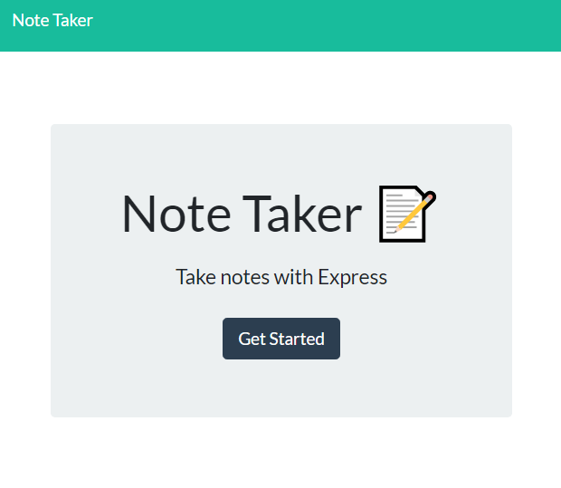
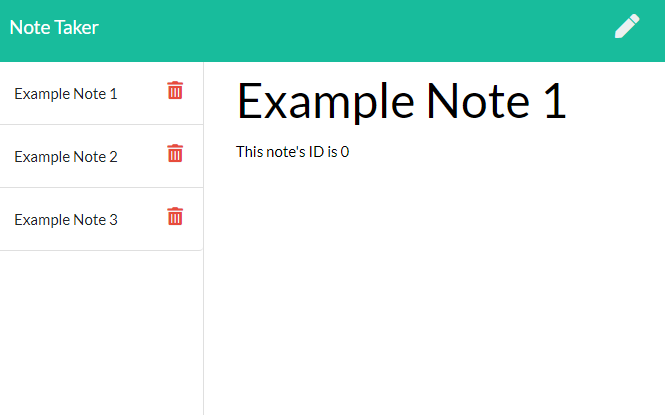

# Note Taker App

Homework 11: Create the server code to handle the backend of a note taking app. 

## [Deployed Link](https://mrj-note-taker.herokuapp.com/)

This app has been deployed using the Heroku platform. The deployed application can be found [here](https://mrj-note-taker.herokuapp.com/).

## Functionality    

This app allows users to write notes, save them, update them, and delete them.  
Upon loading the app the user is shown a landing page. 

From there they can click the link to get to the notes page.  
At this page the user can type to change the currently display notes title or body. Once a change has been made the save button will then be shown. Clicking this will save the current note.  
Clicking the pencil icon will set a blank note as the active note, and once the user has made a change to both the title and body they will be able to save it. Upon saving a new note it will be added to the list on the left hand side.  
Clicking the red trash can icon next to a note in the list on the side will delete it (if it was the currently displayed note then a blank note will become the active note).

